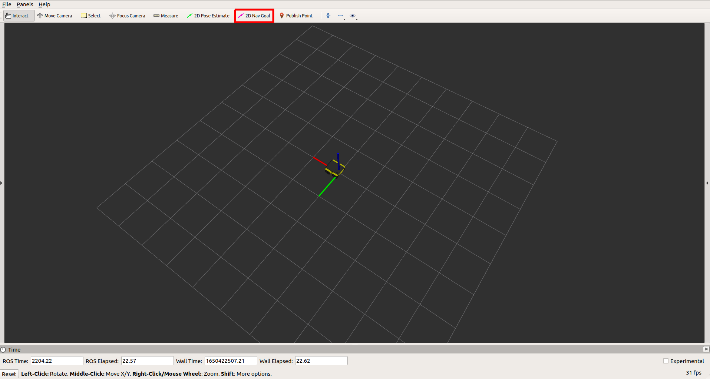
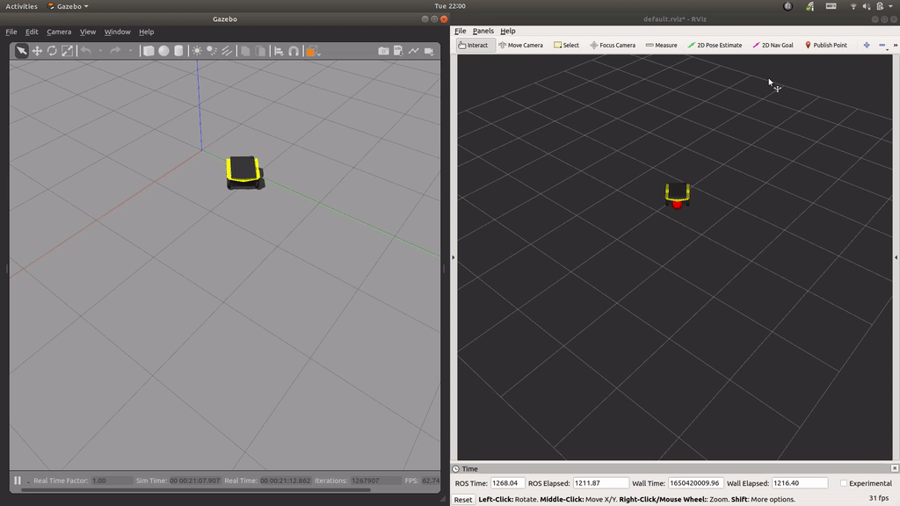
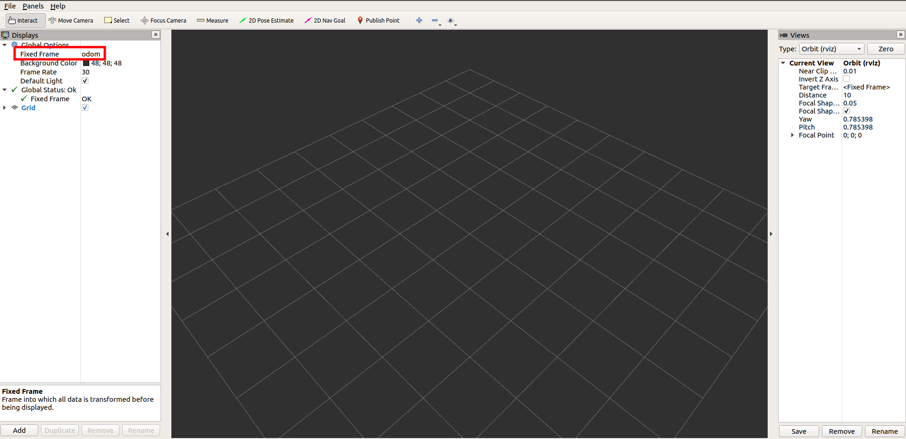
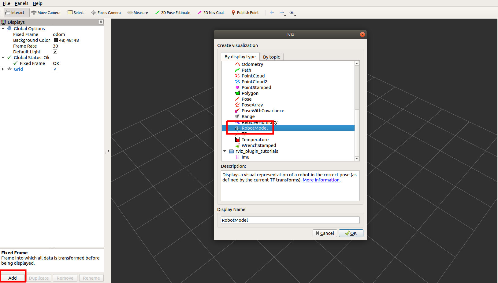
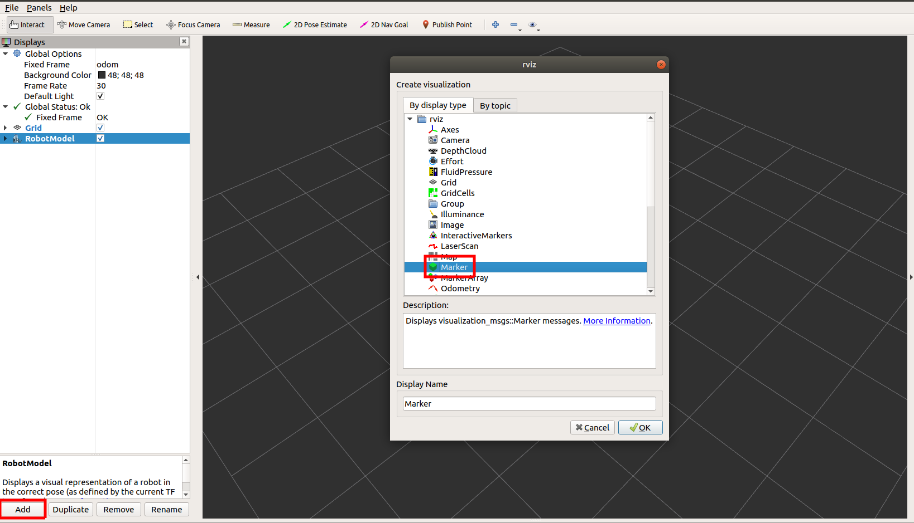
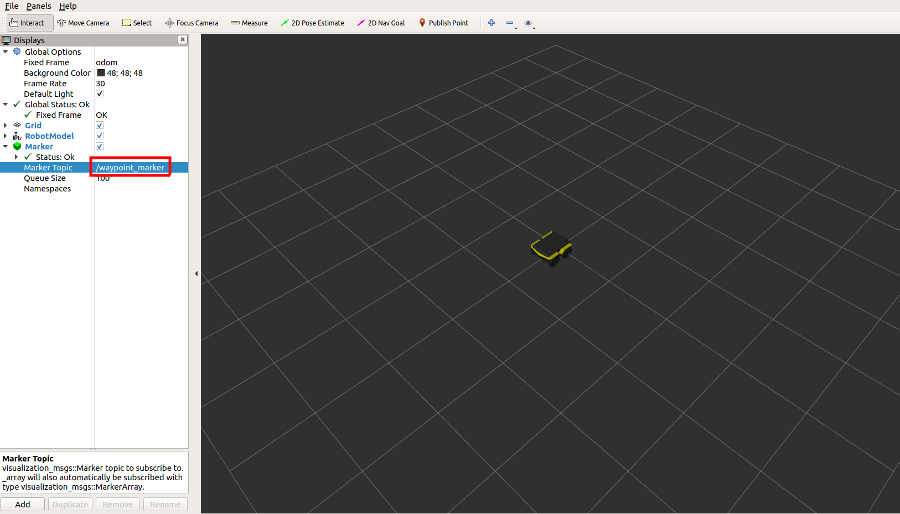

This is a simple PID controller written in Python3 for tracking desired linear and angular velocities of differential-drive vehicles, such as [Heron Unmanned Surface Vehicle (USV)](https://www.clearpathrobotics.com/assets/guides/melodic/heron/index.html), [Jackal Unmanned Ground Vehicle (UGV)](http://www.clearpathrobotics.com/assets/guides/noetic/jackal/), and [Husky UGV](https://www.clearpathrobotics.com/assets/guides/kinetic/husky/index.html). We will use the Jackal simulator as a running example.

Heron USV | Jackal UGV | Husky UGV
:-------------------------:|:-------------------------:|:-------------------------:
 |   | 

---

# Table of contents

* [Jackal Simulator](#jackal)
* [Tracking PID Controller](#pid)
* [(Optional) Configuration of RViz](#rviz)

---

<a name="jackal"></a>

# Jackal Simulation

To install Jackal simulator, make sure you have a working ROS installation on your Ubuntu desktop. We use Ubuntu 18.04 which corresponds to ROS `melodic`. Change the ROS distribution accordingly based on your OS version, and install the following Jackal simulator packages:

```bash
sudo apt-get install ros-melodic-jackal-simulator ros-melodic-jackal-desktop ros-melodic-jackal-navigation
```

Make sure your `~/.bashrc` has the following settings and remember to `source ~/.bashrc` after modifying it:

```bash
export ROS_MASTER_URI=http://localhost:11311
export ROS_HOSTNAME=localhost
```

To launch simulated Jackal in an empty world, run the following command:

```bash
# Terminal #1
roslaunch jackal_gazebo empty_world.launch
```

We should see the simulated vehicle on an open ground.


<a name="pid"></a>

# Tracking PID Controller

ROS Melodic does not support Python3 natively but our code is written in Python3. To bypass this problem, we can install ROS Noetic in a conda environment following the instructions given by [RoboStack](https://github.com/RoboStack/ros-noetic). If your ROS distribution supports Python3 or you have an existing conda environment, feel free to skip this step. Assuming that you have a ROS noetic conda environment called `robostackenv`, clone and build the `diff_drive_tracking_pid` package in a `catkin` workspace.

```bash
# Terminal #2
conda activate robostackenv
mkdir -p ~/robostack_ws/src
cd ~/robostack_ws/src
git clone https://github.com/Weizhe-Chen/tracking_pid.git
cd ..
catkin build
. devel/setup.bash  # `.` is equivalent to `source`
rosrun tracking_pid tracking_pid_node.py
```

If everything goes well, we shall see the following terminal output, showing the robot's pose.


Open another terminal (terminal #3), run `rviz` &rarr; select `File` &rarr; `Open Config` &rarr; find `jackal.rviz` in `tracking_pid/rviz/`.



Now we can send a goal using the `2D Nav Goal` tool.



We can adjust the controller parameters on-the-fly using `rqt_reconfigure`:

```bash
rosrun rqt_reconfigure rqt_reconfigure
```


<a name="rviz"></a>
# (Optional) Configuration of RViz

In case opening `jackal.rviz` does not work, we can configure RViz manually via the following steps. Open a new terminal and run `rviz`:

```bash
rviz
```


Change the `Fixed Frame` to `odom`.



Add a `RobotModel`.




